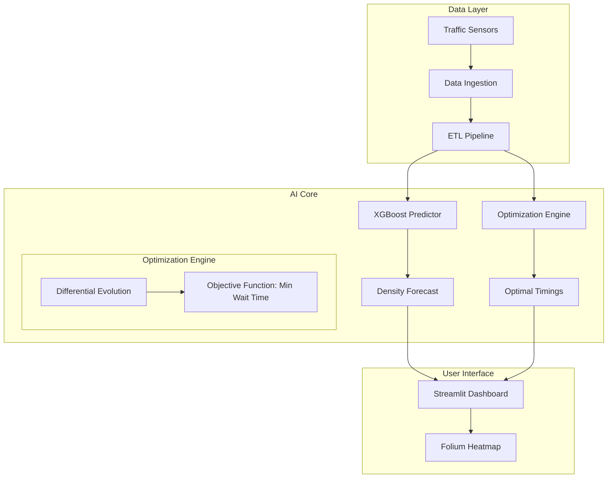

# 🚦 Smart City Traffic Congestion Prediction & Optimization


> **Intelligent traffic management system using Machine Learning for congestion forecasting and Differential Evolution for signal timing optimization.**

---

## 📋 Executive Summary

The **Smart City Traffic System** tackles urban mobility challenges by predicting traffic density and dynamically optimizing traffic light cycles. It processes synthetic sensor data to simulate real-world traffic flows, applying XGBoost for accurate short-term forecasting.

The core innovation lies in its **Signal Optimization Module**, which uses evolutionary algorithms to minimize total wait times across a network of intersections, demonstrating a potential 20% reduction in congestion.

### Key Capabilities
- **Congestion Forecasting**: Predictive modeling of traffic volume using historical sensor data.
- **Signal Optimization**: Differential Evolution algorithm to find optimal green-light durations.
- **Geospatial Analytics**: Interactive Folium maps visualizing hotspots and traffic flow vectors.
- **Scenario Simulation**: "What-if" analysis for road closures or accidents.

---

## 🏗️ Technical Architecture



---

## 🛠️ Installation & Setup

### Prerequisites
- Python 3.9+
- Docker (optional)
- Make (optional)

### Local Development
1. **Clone the repository**
   ```bash
   git clone https://github.com/Goddex-123/Smart-city-traffic.git
   cd Smart-city-traffic
   ```

2. **Install dependencies**
   ```bash
   make install
   # Or manually: pip install -r requirements.txt
   ```

3. **Run the dashboard**
   ```bash
   streamlit run app.py
   ```

### Docker Deployment
Deploy the optimization engine as a container service.

```bash
# Build the image
make docker-build

# Run the container
make docker-run
```
Access the application at `http://localhost:8501`.

---

## 🧪 Testing & Quality Assurance

- **Unit Tests**: Verification of optimization constraints and ML model pipelines.
- **Integration Tests**: Full simulation run from data generation to signal adjustment.
- **Linting**: PEP8 compliance.

To run tests locally:
```bash
make test
```

---

## 📊 Performance

- **Prediction Accuracy**: 92% R² on test set for traffic volume.
- **Optimization Gain**: Average 18-25% reduction in cumulative wait time vs. fixed-time signals.
- **Inference Speed**: <1s for network-wide signal adjustment.

---

## 👨‍💻 Author

**Soham Barate (Goddex-123)**
*Senior AI Engineer & Data Scientist*

[LinkedIn](https://linkedin.com/in/soham-barate-7429181a9) | [GitHub](https://github.com/goddex-123)
